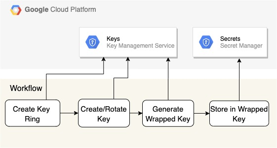

## Data Loss Prevention Templates

The Cloud DLP supports two types of templates:

De-identification templates: Templates for saving configuration information for de-identification jobs, including both infoType and record (structured dataset) transformations.

Inspection templates: Templates for persisting configuration information for inspection scan jobs, including what predefined or custom detectors to use.

In this repo, we go through an example to deploy DLP templates using Cloud Build.

### Package the DLP Artifact

During this phase, the cloud build  (`cloud-build.yaml`) tests and packages the DLP depolyment artifact. The test during this phase is mainly centered around uniqueness of DLP Template Id and validation of JSON structure.

* `cloudbuild.yaml`: Test and package the DLP template code to deploy. Parameters used in this cloud build are 
    * `_ARTIFACT_REPO`: Repos where artifact is published. We use GCS for repository.  While storing artifact in GCS bucket, we get the SHORT SHA of the last commit and package is stored in that prefix with name `DLPTemplates.zip`
    * `_DIFFBUILD`: Depending on the choice, decides to package the differential or all the templates. This cloud build packages the publishes to artifact repository.
  
#### Generate KeyRing, Keys and Wrapped Keys

The diagram below shows the workflow that generates data encryption key, keyring, key and key-encryption key (KEK).



For each field that require pseudonymization, create a Data encryption Key (DEK). One of the way to generate a DEK is using OpenSSL is shown below
```export DEK=$(openssl rand -base64 32);```

Store the DEK in secure place. DLP recommends to use KMS wrapped key for pseudonymization of data.

* `cloudbuild_deploy_keys.yaml`: The deployment script creates the key-ring if not preset, key if not present and rotates the key if required. The build file generates the wrapped key based on the latest version of the key and data encryption key (DEK). It also stores the wrapped key in the Secret Manager. Parameters used in this cloud build are:
    * `_PROJECTID` : GCP Project Id where KMS key ring keys and secret manager are located.
    * `_LOCATION` : Location for the key ring example: global, us-central1
    * `_KEYRING`: Key ring name
    * `_KEY`: Key name. It generally corresponds to field name. For example key for feild Email is Email.
    * `_ROTATE_KEY`: It takes the boolean value (true | false). If true, the depolyment will rotate the key are creates a new wrapped key and store in secret manage.
    * `_DEK`: Data encrption key

#### Deploy DLP Templates

Reads the KMS Wrapped keys from the secret manager. Based on the data in secret manager, interpolates the DLP JSON Template.


* The cloud build to deploy templates is `cloudbuild-deploy.yaml`. Below are the paramaters used in cloud build:
    * `_PROJECTID` : GCP Project Id where KMS key ring keys and secret manager are located.
    * `_ARTIFACT_REPO`: Repos where artifact is published.
    * `_SHORT_SHA`: Prefix where deployment package is stored.