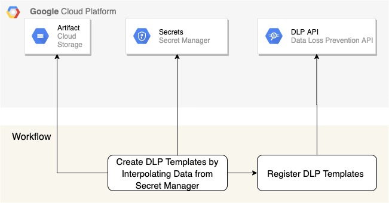

## Data Loss Prevention Templates

The Cloud DLP supports two types of templates:

De-identification templates: Templates for saving configuration information for de-identification jobs, including both infoType and record (structured dataset) transformations.

Inspection templates: Templates for persisting configuration information for inspection scan jobs, including what predefined or custom detectors to use.

In this repo, we go through an example to deploy DLP templates using Cloud Build.

#### Generate KeyRing, Keys and Wrapped Keys

The repository contians an example for deploying Data Loss Prevention Templates using Cloud build. The diagram below shows the workflow that generates data encryption key, keyring, key and key-encryption key (KEK).

For each field that require pseudonymization, create a Data encryption Key (DEK). Store the DEK in the secure place. DLP recommends to use KMS wrapped key for pseudonymization of data. The workflow diagram above creates a keyring if not present. Create a Key and generate the wrapped key. Finally, store the wrapped key in the secret manager.

Cloud Build to create Keyring, key and to generate Key Encryption key and then finally store the KEK in Secret Manager is in `cloud-builds/cloudbuild_deploy_keys.yaml`.

#### Deploy DLP Templates

Read the KMSWrapped keys from the secret manager. Based on the data in secret manager, interpolate the JSON Template.

There are multiple cloud builds:
- `cloudbuild_deploy_keys.yaml`: The deployment script creates the keyring if not preset, keys and generate the wrapped keys from data encryption key (DEK).
- `cloudbuild.yaml`: Package the differnetial code to deploy.
- `cloudbuild-deploy.yaml`: Deploy the packaged code deployed by `cloudbuild.yaml`.
- `cloudbuild_fullbuild.yaml`: Package all the templates and code for deployment.
